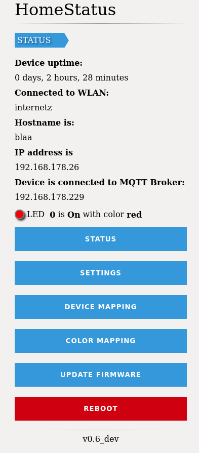
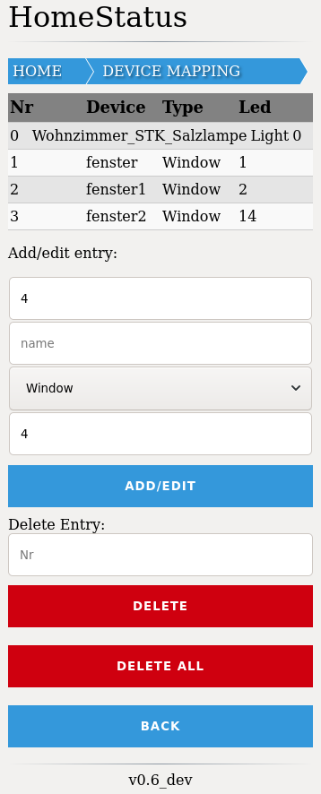
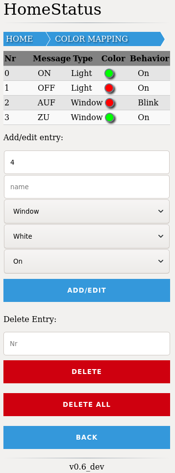

**What is HomeStatusDisplay**
---
Show status information sent via MQTT (e.g. from FHEM or any other MQTT-speaking system) using RGB LEDs.

It originally written by Bernd Schubart.
- [HomeStatusDisplay@Github](https://github.com/MTJoker/HomeStatusDisplay)
- [https://www.bernd-schubart.de/](https://www.bernd-schubart.de/)

**Screenshots**
---




**Changes**
---
- Added FastLED lib
- Add possibility to connect to MQTT Brocker with username and password
- Add possibility to change the Hostname
- Webinterface redesign
- some HTML fixes

**Compile**
---
You need:
- Arduino IDE or Platform IO (recommended)
- FastLED Lib [FastLED](https://github.com/FastLED/FastLED)
- Pubsubclient LIB [pubsubclient](https://github.com/knolleary/pubsubclient)
- ArduinoJson ***v5.x*** LIB [ArduinoJson](https://github.com/bblanchon/ArduinoJson)

**Config**
---
Please define your LED Stripe Type in HSDLeds.hpp.

For Ledtype with DATAPIN only, like ***Neopixel***, comment out
`#define HASCLOCKPIN`

For Ledtype with DATAPIN and COLORORDER, like ***WS2811***, comment out
`#define HASCLOCKPINANDCOLORORDER`

For Ledtype that has DATAPIN, CLOCKPIN and COLORORDER, like ***APA102***, comment out `#define HASALL`

Even ***don't forget*** to define right choices in `#ifdef` blocks to fit
your setup.

**Example**
---
APA102 LED Stripe setup:

comment out `#define HASALL` and
set DATAPIN **3**, CLOCKPIN **2** an COLORORDER **BGR** in `#ifdef` block:


```
#ifdef HASALL
  #define DATAPIN 3
  #define CLOCKPIN 2
  #define COLORORDER BGR
#endif
```

a good Reference is fastled wiki:
[FastLED Wiki](https://github.com/FastLED/FastLED/wiki/Chipset-reference#upcoming)

or their examples directory:
[FastLED Examples](https://github.com/FastLED/FastLED/tree/master/examples)